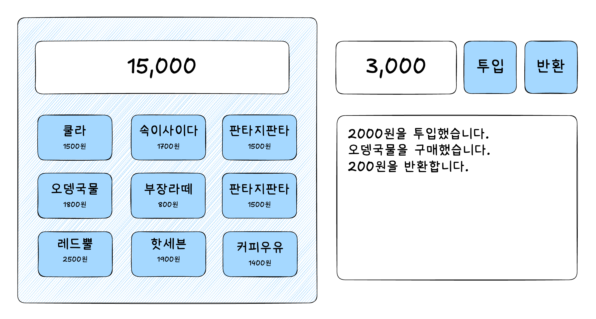

# InnerCircle Frontend Onboarding Project

온보딩 프로젝트로 바닐라 자바스크립트 버전으로 주어진 명세를 만족하는 자판기를 구현합니다.

## 목적

- 개개인의 실력 평가를 위한 온보딩 프로젝트입니다.
- 내부적인 평가이므로 공개되지 않고 맞춤형 피드백, 프로젝트 팀 구성 등에만 활용됩니다.
- 동일한 요구 사항의 서로 다른 구현을 살펴보고 다른 사람의 코드를 통해 배울 수 있습니다.
- 의도적으로 밝히지 않은 기능 명세가 존재할 수 있습니다.

## 요구사항

- 위 그림과 같이 상자 안에 3x3 형태로 상품 버튼이 배열되는 자판기입니다.
- 상품 버튼에는 두 줄의 텍스트가 있으며, 첫 번째 줄은 상품명, 두 번째 줄은 가격을 표시합니다.
- 버튼 상단에는 금액을 표시하는 화면이 있습니다.
  - 금액 표시창은 항상 숫자값을 표시하며 기본값은 `0`입니다.
  - 숫자는 중간 정렬되고 세 자리마다 쉼표(,)를 표시합니다.
- 자판기 오른쪽으로 배치된 입력 란에 숫자를 입력한 후 `투입` 버튼을 누르면 금액이 증가합니다.
  - 금액은 양수만 입력할 수 있습니다.
  - 금액을 투입한 후에 입력창은 빈 칸으로 초기화합니다.
- 이 애플리케이션에서 상품명과 금액은 **자주 변경될 수 있다**고 가정합니다. 이 부분을 고려하여 유연하게 설계해주세요.
- 상품 버튼을 클릭하면 상품이 구입되고, 상품 금액만큼 잔액에서 차감합니다.
  - 상품 버튼을 클릭했을 때 투입된 금액이 상품 가격보다 적으면 버튼을 누르는 동안 금액 표시창에 상품 금액이 표시됩니다.
  - 버튼을 누르지 않을 때는 투입된 금액이 표시됩니다.
- 모든 동작(투입, 구매 등)은 금액 투입 입력란 하단에 배치된 로그창에 기록합니다. 최신 로그가 아래에 표시됩니다.
  - 박스 크기보다 로그가 길어지면 로그가 스크롤됩니다. 또한 가장 마지막에 추가된 로그로 자동 스크롤됩니다.
- 상품 버튼은 `default`, `hover`, `active` 중 하나의 상태가 되는데, 각 상태는 시각적으로 구분이 되어야 합니다.

> ⚠️ Note1: 명시적으로 요구하지 않은 시각적인 요소는 자유롭게 구현해도 좋습니다.

## 선택 과제

빠르게 프로젝트를 완료한 분들을 위한 추가 과제입니다. 시간이 부족하면 수행하지 않으셔도 좋습니다.

### 선택 과제 1

- 반응형 화면을 구성합니다.
  - 화면이 작아지면 자판기 박스 아래에 금액 투입 및 로그 UI가 위치합니다.
  - 자판기 박스의 너비는 화면 너비를 넘을 수 없습니다.

### 선택 과제 2

- 가장 자신있는 프레임워크를 사용하여 동일한 기능을 구현합니다.
- 프레임워크를 사용한 버전은 다른 브랜치에서 작업해주세요. 예) `taegon-react`

### 선택 과제 3

- 단위 테스트를 작성하세요.

## 작업 안내

- 개인 이름으로 메인 브랜치를 포크해서 작업을 시작합니다. 예) `taegon`
- Node.js 프로젝트를 신규로 설정하고, 개인별로 PR을 공개적으로 먼저 작성한 후에 작업을 시작합니다.
  - 이때 PR에는 `WIP` 레이블을 붙여서 작업 중임을 알게 해주세요.
  - 코드를 마무리해서 리뷰받을 준비가 되면 `WIP` 레이블을 제거하고, `Needs Review` 레이블을 추가해주세요.
  - 피드백을 받은 후 추가 작업을 진행할 때는 `WIP` 레이블을 다시 추가하고 `Needs Review` 레이블을 제거해주세요.
- 최소 기능 단위로 완성할 때마다 커밋합니다.
- 자바스크립트에는 아무런 라이브러리를 사용할 수 없습니다.
- CSS 작성은 라이브러리나 프레임워크를 사용해도 괜찮습니다.
- 빌드 툴은 자유롭게 선택할 수 있습니다.

## 평가 항목

- 웹 표준, 웹 접근성, 코드의 가독성, 효율성을 고려하였는가
- 상품명과 금액의 변경에 유연하게 대처할 수 있도록 작성되었는가
- 작성한 코드의 의도를 충분히 잘 설명할 수 있는가
